# CSII Architecture Diagrams - Complete System Documentation

## 1. System Overview - High Level Architecture

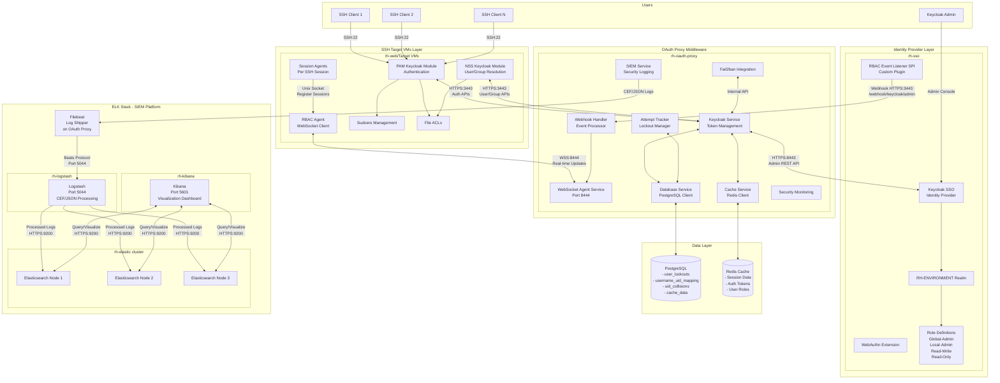
```mermaid
graph TB
    subgraph "Users"
        U1[SSH Client 1]
        U2[SSH Client 2]
        U3[SSH Client N]
        AD[Keycloak Admin]
    end

    subgraph "SSH Target VMs Layer"
        subgraph "rh-web/Target VMs"
            PAM[PAM Keycloak Module<br/>Authentication]
            NSS[NSS Keycloak Module<br/>User/Group Resolution]
            RBAC[RBAC Agent<br/>WebSocket Client]
            SA[Session Agents<br/>Per SSH Session]
            SUDO[Sudoers Management]
            ACL[File ACLs]
        end
    end

    subgraph "OAuth Proxy Middleware"
        subgraph "rh-oauth-proxy"
            KS[Keycloak Service<br/>Token Management]
            WSS[WebSocket Agent Service<br/>Port 8444]
            DS[Database Service<br/>PostgreSQL Client]
            CS[Cache Service<br/>Redis Client]
            SIEM[SIEM Service<br/>Security Logging]
            SMS[Security Monitoring]
            F2B[Fail2ban Integration]
            ATK[Attempt Tracker<br/>Lockout Manager]
            WH[Webhook Handler<br/>Event Processor]
        end
    end

    subgraph "Identity Provider Layer"
        subgraph "rh-sso"
            KC[Keycloak SSO<br/>Identity Provider]
            EL[RBAC Event Listener SPI<br/>Custom Plugin]
            WE[WebAuthn Extension]
            REALM[RH-ENVIRONMENT Realm]
            ROLES[Role Definitions<br/>Global-Admin<br/>Local-Admin<br/>Read-Write<br/>Read-Only]
        end
    end

    subgraph "Data Layer"
        PG[(PostgreSQL<br/>- user_lockouts<br/>- username_uid_mapping<br/>- uid_collisions<br/>- cache_data)]
        RD[(Redis Cache<br/>- Session Data<br/>- Auth Tokens<br/>- User Roles)]
    end

    subgraph "ELK Stack - SIEM Platform"
        subgraph "rh-elastic cluster"
            ES1[Elasticsearch Node 1]
            ES2[Elasticsearch Node 2]
            ES3[Elasticsearch Node 3]
        end

        subgraph "rh-logstash"
            LS[Logstash<br/>Port 5044<br/>CEF/JSON Processing]
        end

        subgraph "rh-kibana"
            KB[Kibana<br/>Port 5601<br/>Visualization Dashboard]
        end

        FB[Filebeat<br/>Log Shipper<br/>on OAuth Proxy]
    end

    U1 & U2 & U3 -->|SSH:22| PAM
    AD -->|Admin Console| KC
    PAM <-->|HTTPS:3443<br/>Auth APIs| KS
    NSS <-->|HTTPS:3443<br/>User/Group APIs| KS
    RBAC <-->|WSS:8444<br/>Real-time Updates| WSS
    SA -->|Unix Socket<br/>Register Sessions| RBAC

    REALM --> ROLES
    KC --> REALM
    KS <-->|HTTPS:8443<br/>Admin REST API| KC
    EL -->|Webhook HTTPS:3443<br/>/webhook/keycloak/admin| WH
    WH --> WSS

    DS <--> PG
    CS <--> RD
    KS <--> DS
    KS <--> CS
    ATK <--> DS
    F2B <-->|Internal API| KS

    %% ELK Integration
    SIEM -->|CEF/JSON Logs| FB
    FB -->|Beats Protocol<br/>Port 5044| LS
    LS -->|Processed Logs<br/>HTTPS:9200| ES1 & ES2 & ES3
    KB <-->|Query/Visualize<br/>HTTPS:9200| ES1 & ES2 & ES3

    PAM --> SUDO
    PAM --> ACL
    NSS --> ACL
```

## 2. Complete SSH Login Flow - All Scenarios

```mermaid
sequenceDiagram
    participant User
    participant SSHD
    participant NSS
    participant PAM
    participant OAuth
    participant DB as PostgreSQL
    participant Cache as Redis
    participant Keycloak
    participant Agent as RBAC Agent
    participant SA as Session Agent

    User->>SSHD: SSH connection (port 22)

    Note over SSHD: Phase 1: User Resolution via NSS
    SSHD->>NSS: getpwnam(username)
    NSS->>NSS: Load /etc/nss_keycloak.conf

    alt NSS Module Not Configured
        NSS-->>SSHD: NSS_STATUS_UNAVAIL
        SSHD-->>User: System error
    else NSS Module Active
        NSS->>OAuth: GET /useruid/{username}

        alt OAuth Proxy Unreachable
            NSS->>NSS: Retry with backoff (3 attempts)
            alt Still Failed
                NSS-->>SSHD: NSS_STATUS_TRYAGAIN
                SSHD-->>User: Service temporarily unavailable
            end
        else OAuth Proxy Available
            OAuth->>Cache: Check Redis for UID

            alt Redis Down
                OAuth->>DB: Direct query username_uid_mapping
                DB-->>OAuth: UID or not found
            else Redis Available
                alt User Cached
                    Cache-->>OAuth: Return cached UID
                else Not Cached
                    OAuth->>Keycloak: GET /users?username={username}

                    alt Keycloak Unreachable
                        OAuth->>DB: Check username_uid_mapping
                        alt User in DB
                            DB-->>OAuth: Return stored UID
                        else Not in DB
                            OAuth-->>NSS: Service unavailable
                        end
                    else Keycloak Available
                        alt User Exists
                            Keycloak-->>OAuth: User attributes
                            OAuth->>DB: Check username_uid_mapping

                            alt UID Exists
                                DB-->>OAuth: Return existing UID
                            else New User
                                OAuth->>DB: Generate new UID (10000-19999)
                                alt UID Collision
                                    OAuth->>DB: Log collision, retry
                                end
                                DB-->>OAuth: New UID assigned
                            end

                            OAuth->>Cache: Store mapping (TTL: 300s)
                        else User Not Found
                            Keycloak-->>OAuth: 404
                            OAuth-->>NSS: User not found
                        end
                    end
                end
            end

            alt User Found
                OAuth-->>NSS: {uid, gid, home, shell}
                NSS->>NSS: fill_passwd_struct()
                NSS-->>SSHD: struct passwd
            else User Not Found
                NSS-->>SSHD: NSS_STATUS_NOTFOUND
                SSHD-->>User: User unknown
            end
        end
    end

    Note over SSHD: Phase 2: PAM Authentication
    SSHD->>PAM: pam_start("sshd", username)
    SSHD->>PAM: pam_authenticate()

    Note over PAM: Load /etc/pam_keycloak.conf
    PAM->>PAM: pam_get_user()
    PAM->>PAM: pam_get_authtok() [prompt password]
    User->>PAM: Enter password

    Note over PAM: Step 1: Check User Type
    PAM->>OAuth: POST /check-user-type

    alt OAuth Unreachable
        PAM-->>SSHD: PAM_AUTHINFO_UNAVAIL
        SSHD-->>User: Authentication service unavailable
    else OAuth Available
        OAuth->>Cache: Check user type cache

        alt Cached
            Cache-->>OAuth: Return user type
        else Not Cached
            OAuth->>Keycloak: GET /users/{username}
            Keycloak-->>OAuth: User with attributes
            OAuth->>OAuth: Check for idp_link attribute
            OAuth->>Cache: Store user type
        end

        OAuth-->>PAM: {is_idp_user, idp_alias, exists}

        alt IdP User Path
            Note over PAM: Identity Provider Authentication
            PAM->>OAuth: POST /initiate-idp-auth

            alt IdP Initiation Success
                OAuth->>Keycloak: Create browser flow
                Keycloak-->>OAuth: {auth_url, code, expires}
                OAuth-->>PAM: Auth URL + QR code
                PAM-->>User: Display auth URL and QR

                User->>User: Open browser/mobile

                loop Poll every 2s for 5min
                    PAM->>OAuth: GET /check-auth-status?code={code}
                    OAuth->>Keycloak: Check auth status

                    alt Authenticated
                        Keycloak-->>OAuth: Success + tokens
                        OAuth-->>PAM: Authenticated

                        alt MFA Required
                            PAM->>User: Choose MFA method
                            alt TOTP Selected
                                PAM->>User: Enter TOTP code
                                User->>PAM: 6-digit code
                                PAM->>OAuth: POST /validate-totp
                                OAuth->>Keycloak: Validate TOTP
                                alt Valid
                                    Keycloak-->>OAuth: Success
                                else Invalid
                                    Keycloak-->>OAuth: Invalid
                                    PAM->>User: Invalid code, retry
                                end
                            else WebAuthn Selected
                                PAM->>OAuth: POST /initiate-webauthn
                                OAuth-->>PAM: Challenge
                                PAM->>User: Touch security key
                                User->>PAM: WebAuthn response
                                PAM->>OAuth: POST /validate-webauthn
                                OAuth->>Keycloak: Validate
                                Keycloak-->>OAuth: Result
                            end
                        else No MFA Setup
                            PAM->>User: Setup required - TOTP or WebAuthn?
                            alt TOTP Setup
                                PAM->>OAuth: POST /generate-totp-qr
                                OAuth->>Keycloak: Generate secret
                                Keycloak-->>OAuth: Secret + QR
                                OAuth-->>PAM: QR code
                                PAM->>User: Scan QR with authenticator
                                User->>PAM: Verification code
                                PAM->>OAuth: POST /confirm-totp-setup
                                OAuth->>Keycloak: Confirm
                                Keycloak-->>OAuth: Setup complete
                            else WebAuthn Setup
                                PAM->>OAuth: POST /register-webauthn
                                OAuth-->>PAM: Registration challenge
                                PAM->>User: Register security key
                                User->>PAM: Registration data
                                PAM->>OAuth: POST /confirm-webauthn
                                OAuth->>Keycloak: Store credential
                                Keycloak-->>OAuth: Registered
                            end
                        end
                    else Timeout
                        OAuth-->>PAM: Timeout
                        PAM-->>SSHD: PAM_AUTH_ERR
                        SSHD-->>User: Authentication timeout
                    else Rejected
                        OAuth-->>PAM: Rejected
                        PAM-->>SSHD: PAM_AUTH_ERR
                        SSHD-->>User: Authentication rejected
                    end
                end
            else IdP Initiation Failed
                OAuth-->>PAM: Error
                PAM-->>SSHD: PAM_AUTH_ERR
                SSHD-->>User: Authentication service error
            end

        else Local User Path
            Note over PAM: Local Keycloak Authentication

            PAM->>OAuth: GET /check-lockout?username={username}
            OAuth->>DB: SELECT FROM user_lockouts

            alt User Locked
                DB-->>OAuth: locked_until > NOW()
                OAuth-->>PAM: {locked: true, until: timestamp}
                PAM-->>User: Account locked until {time}
                PAM-->>SSHD: PAM_AUTH_ERR
                SSHD-->>User: Access denied
            else Not Locked
                PAM->>OAuth: POST /auth
                OAuth->>Keycloak: Direct grant authentication

                alt Authentication Success
                    Keycloak-->>OAuth: Access token
                    OAuth->>DB: DELETE FROM user_lockouts
                    OAuth->>Cache: Store token
                    OAuth-->>PAM: Success + MFA status

                    alt TOTP Required
                        PAM->>User: Enter TOTP code
                        User->>PAM: 6-digit code
                        PAM->>OAuth: POST /validate-totp
                        OAuth->>Keycloak: Validate
                        alt Valid
                            Keycloak-->>OAuth: Success
                            OAuth-->>PAM: MFA success
                        else Invalid
                            Keycloak-->>OAuth: Invalid
                            OAuth->>DB: Record MFA failure
                            alt Max MFA Attempts
                                OAuth->>DB: Lock account
                                PAM-->>SSHD: PAM_AUTH_ERR
                            else Retry
                                PAM->>User: Invalid code
                            end
                        end
                    else WebAuthn Required
                        PAM->>OAuth: POST /initiate-webauthn-auth
                        OAuth-->>PAM: Challenge
                        PAM->>User: Touch security key
                        User->>PAM: WebAuthn response
                        PAM->>OAuth: POST /validate-webauthn
                        OAuth->>Keycloak: Validate
                        Keycloak-->>OAuth: Result
                    else No MFA
                        Note over PAM: Proceed without MFA
                    end

                else Authentication Failed
                    Keycloak-->>OAuth: 401 Unauthorized
                    OAuth->>DB: INSERT/UPDATE user_lockouts
                    DB-->>OAuth: Attempt count

                    alt Attempts >= 5
                        OAuth->>DB: Set locked_until = NOW() + 30min
                        OAuth->>F2B: Report IP for ban
                        OAuth-->>PAM: Account locked
                        PAM-->>User: Too many attempts
                        PAM-->>SSHD: PAM_AUTH_ERR
                    else Attempts < 5
                        OAuth-->>PAM: Invalid (attempts: {n}/5)
                        PAM-->>User: Invalid password ({n}/5)
                        PAM-->>SSHD: PAM_AUTH_ERR
                    end
                end
            end

        else Unknown User Path
            Note over PAM: User not found - check fallback

            alt IdP Fallback Enabled
                PAM->>OAuth: POST /initiate-idp-auth?create=true
                OAuth->>Keycloak: Create user + initiate SSO
                Keycloak-->>OAuth: New user SSO URL
                OAuth-->>PAM: Fallback auth URL
                PAM-->>User: First-time setup URL
                Note over PAM: Continue with IdP flow
            else No Fallback
                PAM-->>SSHD: PAM_USER_UNKNOWN
                SSHD-->>User: User not found
            end
        end
    end

    Note over SSHD: Phase 3: Session Management
    alt Authentication Successful
        SSHD->>PAM: pam_acct_mgmt()
        PAM->>OAuth: GET /user-roles
        OAuth->>Cache: Get roles from cache

        alt Cache Miss
            OAuth->>Keycloak: GET /users/{id}/role-mappings
            Keycloak-->>OAuth: Role list
            OAuth->>Cache: Store roles
        end

        OAuth-->>PAM: {roles: [global-admin|local-admin|read-write|read-only]}

        PAM->>PAM: Map roles to permissions
        alt global-admin
            PAM->>PAM: Set sudoers ALL=(ALL:ALL) NOPASSWD:ALL
        else local-admin
            PAM->>PAM: Set sudoers specific commands
        else read-write
            PAM->>PAM: No sudo, full user access
        else read-only
            PAM->>PAM: Restricted shell, limited commands
        end

        SSHD->>PAM: pam_open_session()

        Note over PAM: Fork session_agent process
        PAM->>SA: Fork with setuid(user_uid)
        SA->>SA: Drop privileges
        SA->>Agent: Connect to /var/run/rbac-agent.sock

        alt Socket Available
            SA->>Agent: REGISTER {username, pid, is_idp}
            Agent->>Agent: Store session info
            Agent->>WSS: Send via WebSocket
            WSS->>WSS: Update userSessions map
            WSS-->>Agent: ACK
            Agent-->>SA: Registered
            SA->>SA: Setup SIGUSR1 handler
        else Socket Unavailable
            SA->>SA: Log warning, continue
        end

        PAM->>PAM: Create home directory if needed
        PAM->>PAM: Set SELinux context
        PAM->>PAM: Apply file ACLs

        PAM-->>SSHD: PAM_SUCCESS
        SSHD->>SSHD: Fork user shell
        SSHD-->>User: Shell prompt

    else Authentication Failed
        PAM-->>SSHD: PAM_AUTH_ERR
        SSHD->>SSHD: Close connection
        SSHD-->>User: Connection closed
    end
```

## 3. WebSocket Connection Lifecycle - All States

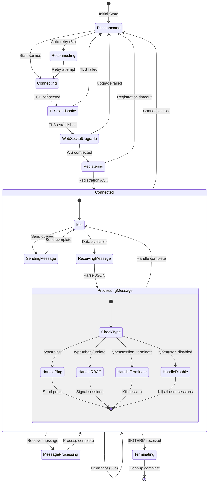
```mermaid
stateDiagram-v2
    [*] --> Disconnected: Initial State

    Disconnected --> Connecting: Start service
    Connecting --> TLSHandshake: TCP connected
    TLSHandshake --> WebSocketUpgrade: TLS established
    WebSocketUpgrade --> Registering: WS connected
    Registering --> Connected: Registration ACK

    Connected --> Connected: Heartbeat (30s)
    Connected --> MessageProcessing: Receive message
    MessageProcessing --> Connected: Process complete

    Connected --> Disconnected: Connection lost
    TLSHandshake --> Disconnected: TLS failed
    WebSocketUpgrade --> Disconnected: Upgrade failed
    Registering --> Disconnected: Registration timeout

    Disconnected --> Reconnecting: Auto-retry (5s)
    Reconnecting --> Connecting: Retry attempt

    Connected --> Terminating: SIGTERM received
    Terminating --> [*]: Cleanup complete

    state Connected {
        [*] --> Idle
        Idle --> SendingMessage: Send queued
        SendingMessage --> Idle: Send complete
        Idle --> ReceivingMessage: Data available
        ReceivingMessage --> ProcessingMessage: Parse JSON
        ProcessingMessage --> Idle: Handle complete

        state ProcessingMessage {
            [*] --> CheckType
            CheckType --> HandlePing: type=ping
            CheckType --> HandleRBAC: type=rbac_update
            CheckType --> HandleTerminate: type=session_terminate
            CheckType --> HandleDisable: type=user_disabled
            HandlePing --> [*]: Send pong
            HandleRBAC --> [*]: Signal sessions
            HandleTerminate --> [*]: Kill session
            HandleDisable --> [*]: Kill all user sessions
        }
    }
```

## 4. Real-time RBAC Update Flow - Complete Scenarios

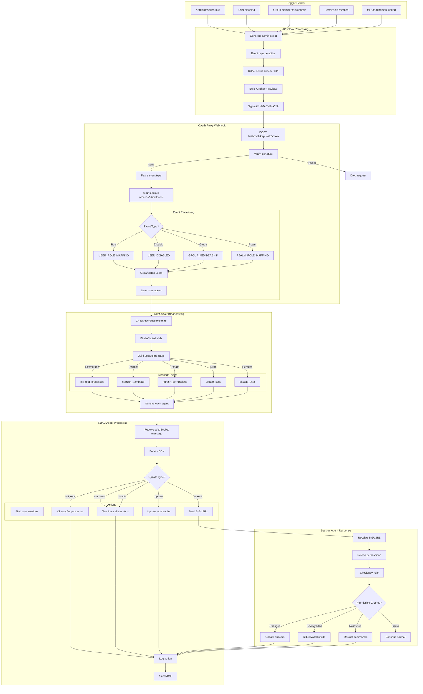
```mermaid
flowchart TD
    subgraph "Trigger Events"
        A1[Admin changes role]
        A2[User disabled]
        A3[Group membership change]
        A4[Permission revoked]
        A5[MFA requirement added]
    end

    subgraph "Keycloak Processing"
        KC1[Generate admin event]
        KC2[Event type detection]
        KC3[RBAC Event Listener SPI]
        KC4[Build webhook payload]
        KC5[Sign with HMAC-SHA256]
    end

    subgraph "OAuth Proxy Webhook"
        WH1[POST /webhook/keycloak/admin]
        WH2[Verify signature]
        WH3[Parse event type]
        WH4[setImmediate processAdminEvent]

        subgraph "Event Processing"
            EP1{Event Type?}
            EP2[USER_ROLE_MAPPING]
            EP3[USER_DISABLED]
            EP4[GROUP_MEMBERSHIP]
            EP5[REALM_ROLE_MAPPING]
            EP6[Get affected users]
            EP7[Determine action]
        end
    end

    subgraph "WebSocket Broadcasting"
        WS1[Check userSessions map]
        WS2[Find affected VMs]
        WS3[Build update message]
        WS4[Send to each agent]

        subgraph "Message Types"
            MT1[kill_root_processes]
            MT2[session_terminate]
            MT3[refresh_permissions]
            MT4[update_sudo]
            MT5[disable_user]
        end
    end

    subgraph "RBAC Agent Processing"
        RA1[Receive WebSocket message]
        RA2[Parse JSON]
        RA3{Update Type?}

        subgraph "Actions"
            AC1[Find user sessions]
            AC2[Send SIGUSR1]
            AC3[Kill sudo/su processes]
            AC4[Terminate all sessions]
            AC5[Update local cache]
        end

        RA4[Log action]
        RA5[Send ACK]
    end

    subgraph "Session Agent Response"
        SA1[Receive SIGUSR1]
        SA2[Reload permissions]
        SA3[Check new role]
        SA4{Permission Change?}
        SA5[Update sudoers]
        SA6[Kill elevated shells]
        SA7[Restrict commands]
        SA8[Continue normal]
    end

    A1 & A2 & A3 & A4 & A5 --> KC1
    KC1 --> KC2
    KC2 --> KC3
    KC3 --> KC4
    KC4 --> KC5
    KC5 --> WH1

    WH1 --> WH2
    WH2 -->|Valid| WH3
    WH2 -->|Invalid| END1[Drop request]
    WH3 --> WH4
    WH4 --> EP1

    EP1 -->|Role| EP2
    EP1 -->|Disable| EP3
    EP1 -->|Group| EP4
    EP1 -->|Realm| EP5

    EP2 & EP3 & EP4 & EP5 --> EP6
    EP6 --> EP7
    EP7 --> WS1

    WS1 --> WS2
    WS2 --> WS3

    WS3 -->|Downgrade| MT1
    WS3 -->|Disable| MT2
    WS3 -->|Update| MT3
    WS3 -->|Sudo| MT4
    WS3 -->|Remove| MT5

    MT1 & MT2 & MT3 & MT4 & MT5 --> WS4
    WS4 --> RA1

    RA1 --> RA2
    RA2 --> RA3

    RA3 -->|kill_root| AC3
    RA3 -->|terminate| AC4
    RA3 -->|refresh| AC2
    RA3 -->|update| AC5
    RA3 -->|disable| AC4

    AC2 --> SA1
    AC3 & AC4 & AC5 --> RA4

    SA1 --> SA2
    SA2 --> SA3
    SA3 --> SA4
    SA4 -->|Changed| SA5
    SA4 -->|Downgraded| SA6
    SA4 -->|Restricted| SA7
    SA4 -->|Same| SA8

    SA5 & SA6 & SA7 --> RA4
    RA4 --> RA5
```

## 5. Session Lifecycle Management - All States

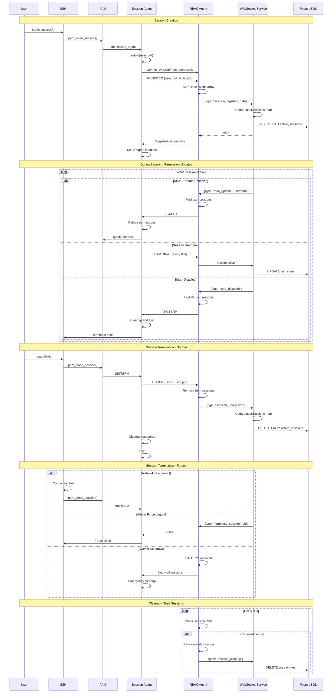
```mermaid
sequenceDiagram
    participant User
    participant SSH
    participant PAM
    participant SA as Session Agent
    participant RBAC as RBAC Agent
    participant WSS as WebSocket Service
    participant DB as PostgreSQL

    Note over User,DB: Session Creation
    User->>SSH: Login successful
    SSH->>PAM: pam_open_session()
    PAM->>SA: Fork session_agent
    SA->>SA: setuid(user_uid)
    SA->>RBAC: Connect /var/run/rbac-agent.sock
    SA->>RBAC: REGISTER {user, pid, tty, is_idp}

    RBAC->>RBAC: Store in sessions array
    RBAC->>WSS: {type: "session_register", data}
    WSS->>WSS: Update userSessions map
    WSS->>DB: INSERT INTO active_sessions
    WSS-->>RBAC: ACK

    RBAC-->>SA: Registration complete
    SA->>SA: Setup signal handlers

    Note over User,DB: During Session - Permission Updates
    loop While session active
        alt RBAC Update Received
            WSS->>RBAC: {type: "rbac_update", username}
            RBAC->>RBAC: Find user sessions
            RBAC->>SA: SIGUSR1
            SA->>SA: Reload permissions
            SA->>PAM: Update sudoers
        else Session Heartbeat
            SA->>RBAC: HEARTBEAT (every 60s)
            RBAC->>WSS: Session alive
            WSS->>DB: UPDATE last_seen
        else User Disabled
            WSS->>RBAC: {type: "user_disabled"}
            RBAC->>RBAC: Find all user sessions
            RBAC->>SA: SIGTERM
            SA->>SA: Cleanup and exit
            SA->>SSH: Terminate shell
        end
    end

    Note over User,DB: Session Termination - Normal
    User->>SSH: logout/exit
    SSH->>PAM: pam_close_session()
    PAM->>SA: SIGTERM
    SA->>RBAC: UNREGISTER {user, pid}
    RBAC->>RBAC: Remove from sessions
    RBAC->>WSS: {type: "session_unregister"}
    WSS->>WSS: Update userSessions map
    WSS->>DB: DELETE FROM active_sessions
    SA->>SA: Cleanup resources
    SA->>SA: Exit

    Note over User,DB: Session Termination - Forced
    alt Network Disconnect
        SSH->>SSH: Connection lost
        SSH->>PAM: pam_close_session()
        PAM->>SA: SIGTERM
    else Admin Force Logout
        WSS->>RBAC: {type: "terminate_session", pid}
        RBAC->>SA: SIGKILL
        SA->>SSH: Force close
    else System Shutdown
        RBAC->>RBAC: SIGTERM received
        RBAC->>SA: Notify all sessions
        SA->>SA: Emergency cleanup
    end

    Note over User,DB: Cleanup - Stale Sessions
    loop Every 30s
        RBAC->>RBAC: Check session PIDs
        alt PID doesn't exist
            RBAC->>RBAC: Remove stale session
            RBAC->>WSS: {type: "session_cleanup"}
            WSS->>DB: DELETE stale entries
        end
    end
```

## 6. Error Recovery and Resilience Flows

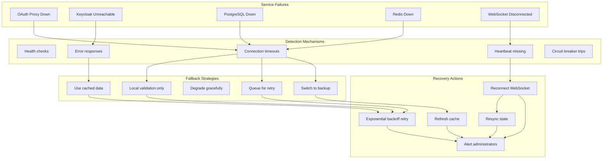
```mermaid
flowchart TD
    subgraph "Service Failures"
        SF1[OAuth Proxy Down]
        SF2[Keycloak Unreachable]
        SF3[PostgreSQL Down]
        SF4[Redis Down]
        SF5[WebSocket Disconnected]
    end

    subgraph "Detection Mechanisms"
        DM1[Health checks]
        DM2[Connection timeouts]
        DM3[Heartbeat missing]
        DM4[Error responses]
        DM5[Circuit breaker trips]
    end

    subgraph "Fallback Strategies"
        FS1[Use cached data]
        FS2[Queue for retry]
        FS3[Degrade gracefully]
        FS4[Switch to backup]
        FS5[Local validation only]
    end

    subgraph "Recovery Actions"
        RA1[Exponential backoff retry]
        RA2[Reconnect WebSocket]
        RA3[Refresh cache]
        RA4[Resync state]
        RA5[Alert administrators]
    end

    SF1 --> DM2
    DM2 --> FS5
    FS5 --> RA1

    SF2 --> DM4
    DM4 --> FS1
    FS1 --> RA1

    SF3 --> DM2
    DM2 --> FS2
    FS2 --> RA1

    SF4 --> DM2
    DM2 --> FS4
    FS4 --> RA3

    SF5 --> DM3
    DM3 --> RA2
    RA2 --> RA4

    RA1 & RA2 & RA3 & RA4 --> RA5
```

## 7. User Disable Flow - Complete Process

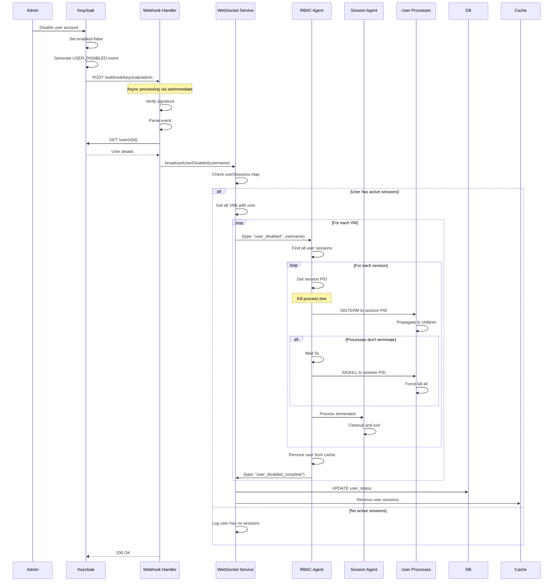
```mermaid
sequenceDiagram
    participant Admin
    participant KC as Keycloak
    participant WH as Webhook Handler
    participant WSS as WebSocket Service
    participant RBAC as RBAC Agent
    participant SA as Session Agent
    participant PROC as User Processes

    Admin->>KC: Disable user account
    KC->>KC: Set enabled=false
    KC->>KC: Generate USER_DISABLED event
    KC->>WH: POST /webhook/keycloak/admin

    Note over WH: Async processing via setImmediate
    WH->>WH: Verify signature
    WH->>WH: Parse event
    WH->>KC: GET /users/{id}
    KC-->>WH: User details

    WH->>WSS: broadcastUserDisabled(username)
    WSS->>WSS: Check userSessions map

    alt User has active sessions
        WSS->>WSS: Get all VMs with user
        loop For each VM
            WSS->>RBAC: {type: "user_disabled", username}

            RBAC->>RBAC: Find all user sessions
            loop For each session
                RBAC->>RBAC: Get session PID

                Note over RBAC: Kill process tree
                RBAC->>PROC: SIGTERM to session PID
                PROC->>PROC: Propagate to children

                alt Processes don't terminate
                    RBAC->>RBAC: Wait 5s
                    RBAC->>PROC: SIGKILL to session PID
                    PROC->>PROC: Force kill all
                end

                RBAC->>SA: Process terminated
                SA->>SA: Cleanup and exit
            end

            RBAC->>RBAC: Remove user from cache
            RBAC->>WSS: {type: "user_disabled_complete"}
        end

        WSS->>DB: UPDATE user_status
        WSS->>Cache: Remove user sessions
    else No active sessions
        WSS->>WSS: Log user has no sessions
    end

    WH-->>KC: 200 OK
```

## 8. Database Schema and Relationships

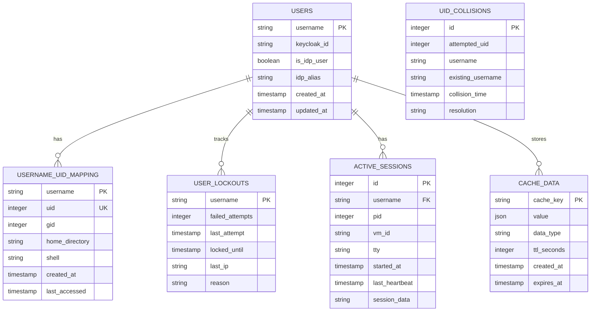
```mermaid
erDiagram
    USERS ||--o{ USERNAME_UID_MAPPING : has
    USERS ||--o{ USER_LOCKOUTS : tracks
    USERS ||--o{ ACTIVE_SESSIONS : has
    USERS ||--o{ CACHE_DATA : stores

    USERS {
        string username PK
        string keycloak_id
        boolean is_idp_user
        string idp_alias
        timestamp created_at
        timestamp updated_at
    }

    USERNAME_UID_MAPPING {
        string username PK
        integer uid UK
        integer gid
        string home_directory
        string shell
        timestamp created_at
        timestamp last_accessed
    }

    UID_COLLISIONS {
        integer id PK
        integer attempted_uid
        string username
        string existing_username
        timestamp collision_time
        string resolution
    }

    USER_LOCKOUTS {
        string username PK
        integer failed_attempts
        timestamp last_attempt
        timestamp locked_until
        string last_ip
        string reason
    }

    ACTIVE_SESSIONS {
        integer id PK
        string username FK
        integer pid
        string vm_id
        string tty
        timestamp started_at
        timestamp last_heartbeat
        string session_data
    }

    CACHE_DATA {
        string cache_key PK
        json value
        string data_type
        integer ttl_seconds
        timestamp created_at
        timestamp expires_at
    }
```

## 9. Network Communication Matrix

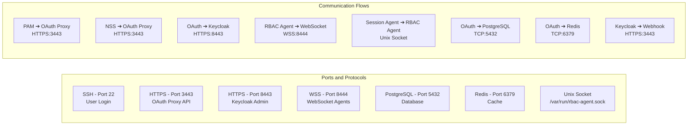
```mermaid
graph LR
    subgraph "Ports and Protocols"
        SSH[SSH - Port 22<br/>User Login]
        HTTPS1[HTTPS - Port 3443<br/>OAuth Proxy API]
        HTTPS2[HTTPS - Port 8443<br/>Keycloak Admin]
        WSS[WSS - Port 8444<br/>WebSocket Agents]
        PG[PostgreSQL - Port 5432<br/>Database]
        REDIS[Redis - Port 6379<br/>Cache]
        UNIX[Unix Socket<br/>/var/run/rbac-agent.sock]
    end

    subgraph "Communication Flows"
        PAM_TO_OAUTH[PAM ➔ OAuth Proxy<br/>HTTPS:3443]
        NSS_TO_OAUTH[NSS ➔ OAuth Proxy<br/>HTTPS:3443]
        OAUTH_TO_KC[OAuth ➔ Keycloak<br/>HTTPS:8443]
        AGENT_TO_WS[RBAC Agent ➔ WebSocket<br/>WSS:8444]
        SA_TO_AGENT[Session Agent ➔ RBAC Agent<br/>Unix Socket]
        OAUTH_TO_DB[OAuth ➔ PostgreSQL<br/>TCP:5432]
        OAUTH_TO_CACHE[OAuth ➔ Redis<br/>TCP:6379]
        KC_TO_WEBHOOK[Keycloak ➔ Webhook<br/>HTTPS:3443]
    end
```

## 10. Permission Mapping and Enforcement

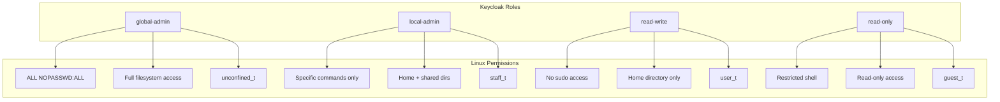
```mermaid
flowchart TD
    subgraph "Keycloak Roles"
        R1[global-admin]
        R2[local-admin]
        R3[read-write]
        R4[read-only]
    end

    subgraph "Linux Permissions"
        SUDO1[ALL NOPASSWD:ALL]
        SUDO2[Specific commands only]
        SUDO3[No sudo access]
        SUDO4[Restricted shell]

        ACL1[Full filesystem access]
        ACL2[Home + shared dirs]
        ACL3[Home directory only]
        ACL4[Read-only access]

        SEL1[unconfined_t]
        SEL2[staff_t]
        SEL3[user_t]
        SEL4[guest_t]
    end

    R1 --> SUDO1
    R1 --> ACL1
    R1 --> SEL1

    R2 --> SUDO2
    R2 --> ACL2
    R2 --> SEL2

    R3 --> SUDO3
    R3 --> ACL3
    R3 --> SEL3

    R4 --> SUDO4
    R4 --> ACL4
    R4 --> SEL4


```

## 11. MFA Authentication Flows

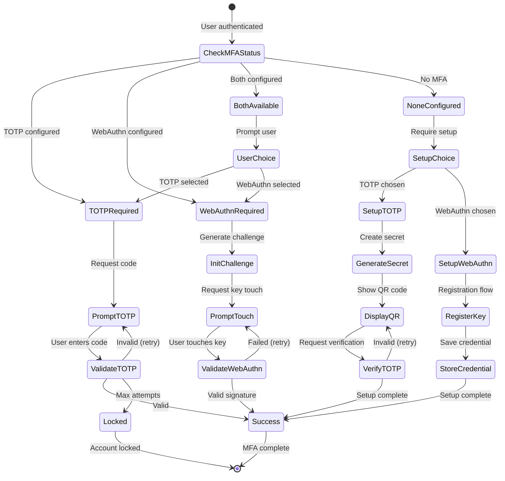
```mermaid
stateDiagram-v2
    [*] --> CheckMFAStatus: User authenticated

    CheckMFAStatus --> TOTPRequired: TOTP configured
    CheckMFAStatus --> WebAuthnRequired: WebAuthn configured
    CheckMFAStatus --> BothAvailable: Both configured
    CheckMFAStatus --> NoneConfigured: No MFA

    BothAvailable --> UserChoice: Prompt user
    UserChoice --> TOTPRequired: TOTP selected
    UserChoice --> WebAuthnRequired: WebAuthn selected

    TOTPRequired --> PromptTOTP: Request code
    PromptTOTP --> ValidateTOTP: User enters code
    ValidateTOTP --> Success: Valid
    ValidateTOTP --> PromptTOTP: Invalid (retry)
    ValidateTOTP --> Locked: Max attempts

    WebAuthnRequired --> InitChallenge: Generate challenge
    InitChallenge --> PromptTouch: Request key touch
    PromptTouch --> ValidateWebAuthn: User touches key
    ValidateWebAuthn --> Success: Valid signature
    ValidateWebAuthn --> PromptTouch: Failed (retry)

    NoneConfigured --> SetupChoice: Require setup
    SetupChoice --> SetupTOTP: TOTP chosen
    SetupChoice --> SetupWebAuthn: WebAuthn chosen

    SetupTOTP --> GenerateSecret: Create secret
    GenerateSecret --> DisplayQR: Show QR code
    DisplayQR --> VerifyTOTP: Request verification
    VerifyTOTP --> Success: Setup complete
    VerifyTOTP --> DisplayQR: Invalid (retry)

    SetupWebAuthn --> RegisterKey: Registration flow
    RegisterKey --> StoreCredential: Save credential
    StoreCredential --> Success: Setup complete

    Success --> [*]: MFA complete
    Locked --> [*]: Account locked
```

## 12. Cache Strategy and Data Flow

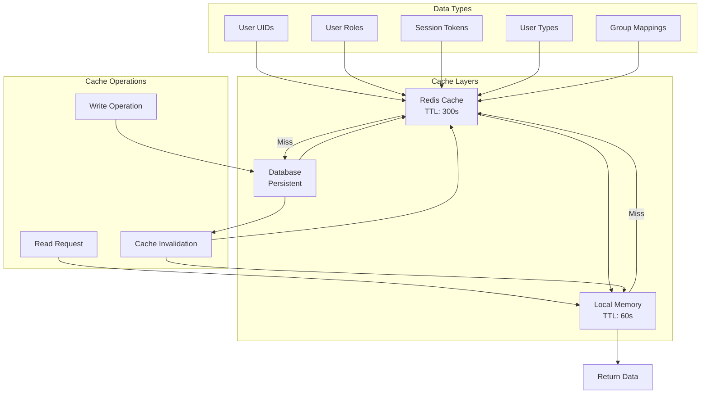
```mermaid
flowchart TD
    subgraph "Cache Layers"
        L1[Redis Cache<br/>TTL: 300s]
        L2[Local Memory<br/>TTL: 60s]
        L3[Database<br/>Persistent]
    end

    subgraph "Cache Operations"
        READ[Read Request]
        WRITE[Write Operation]
        INVALIDATE[Cache Invalidation]
    end

    subgraph "Data Types"
        D1[User UIDs]
        D2[User Roles]
        D3[Session Tokens]
        D4[User Types]
        D5[Group Mappings]
    end

    READ --> L2
    L2 -->|Miss| L1
    L1 -->|Miss| L3
    L3 --> L1
    L1 --> L2
    L2 --> Response[Return Data]

    WRITE --> L3
    L3 --> INVALIDATE
    INVALIDATE --> L1
    INVALIDATE --> L2

    D1 & D2 & D3 & D4 & D5 --> L1
```

## 13. Security and Audit Flow

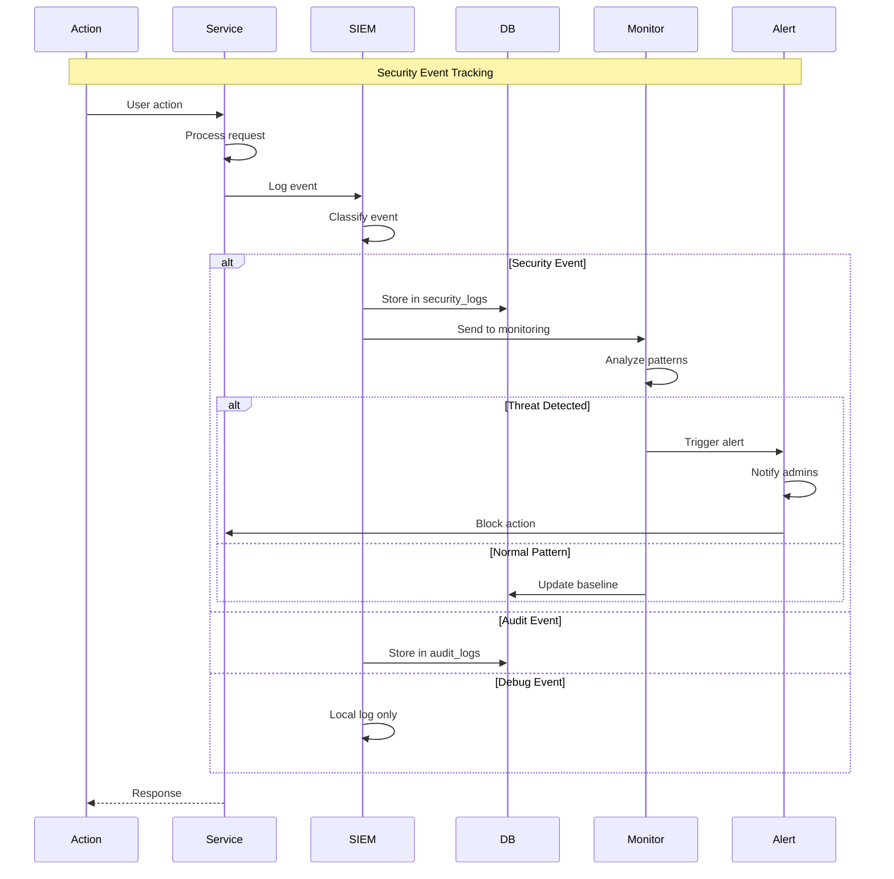
```mermaid
sequenceDiagram
    participant Action
    participant Service
    participant SIEM
    participant DB
    participant Monitor
    participant Alert

    Note over Action,Alert: Security Event Tracking

    Action->>Service: User action
    Service->>Service: Process request
    Service->>SIEM: Log event

    SIEM->>SIEM: Classify event
    alt Security Event
        SIEM->>DB: Store in security_logs
        SIEM->>Monitor: Send to monitoring

        Monitor->>Monitor: Analyze patterns
        alt Threat Detected
            Monitor->>Alert: Trigger alert
            Alert->>Alert: Notify admins
            Alert->>Service: Block action
        else Normal Pattern
            Monitor->>DB: Update baseline
        end
    else Audit Event
        SIEM->>DB: Store in audit_logs
    else Debug Event
        SIEM->>SIEM: Local log only
    end

    Service-->>Action: Response
```

## 14. Fail2ban Integration Flow

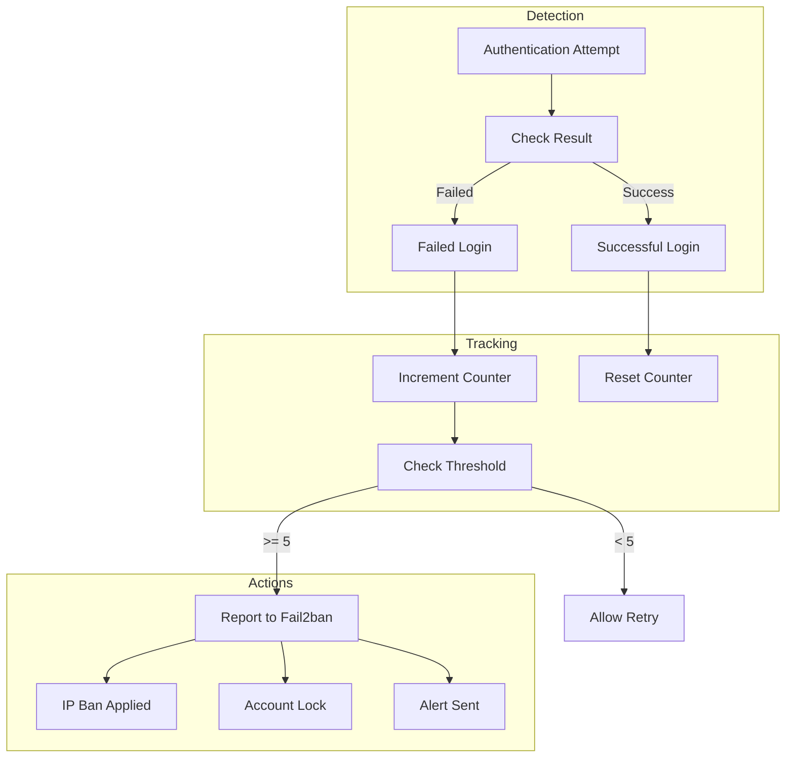
```mermaid
flowchart TD
    subgraph "Detection"
        AUTH[Authentication Attempt]
        CHECK[Check Result]
        FAIL[Failed Login]
        SUCCESS[Successful Login]
    end

    subgraph "Tracking"
        COUNT[Increment Counter]
        THRESH[Check Threshold]
        RESET[Reset Counter]
    end

    subgraph "Actions"
        REPORT[Report to Fail2ban]
        BAN[IP Ban Applied]
        LOCK[Account Lock]
        NOTIFY[Alert Sent]
    end

    AUTH --> CHECK
    CHECK -->|Failed| FAIL
    CHECK -->|Success| SUCCESS

    FAIL --> COUNT
    COUNT --> THRESH
    THRESH -->|< 5| Continue[Allow Retry]
    THRESH -->|>= 5| REPORT

    REPORT --> BAN
    REPORT --> LOCK
    REPORT --> NOTIFY

    SUCCESS --> RESET
```

## 15. Home Directory Management

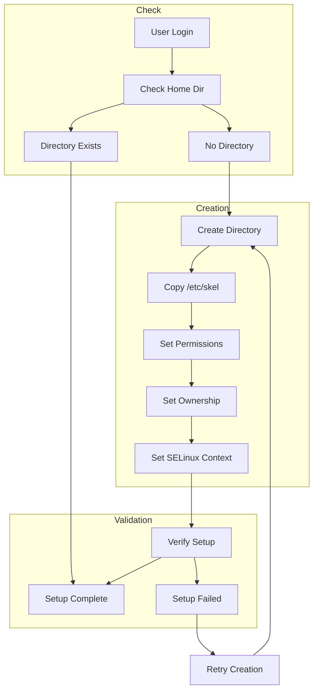
```mermaid
flowchart TD
    subgraph "Check"
        LOGIN[User Login]
        CHECK_HOME[Check Home Dir]
        EXISTS[Directory Exists]
        NOT_EXISTS[No Directory]
    end

    subgraph "Creation"
        CREATE[Create Directory]
        SKEL[Copy /etc/skel]
        PERMS[Set Permissions]
        OWNER[Set Ownership]
        SELINUX[Set SELinux Context]
    end

    subgraph "Validation"
        VERIFY[Verify Setup]
        OK[Setup Complete]
        ERROR[Setup Failed]
    end

    LOGIN --> CHECK_HOME
    CHECK_HOME --> EXISTS
    CHECK_HOME --> NOT_EXISTS

    EXISTS --> OK
    NOT_EXISTS --> CREATE

    CREATE --> SKEL
    SKEL --> PERMS
    PERMS --> OWNER
    OWNER --> SELINUX
    SELINUX --> VERIFY

    VERIFY --> OK
    VERIFY --> ERROR

    ERROR --> RETRY[Retry Creation]
    RETRY --> CREATE
```

## 16. WebSocket Message Types and Handlers

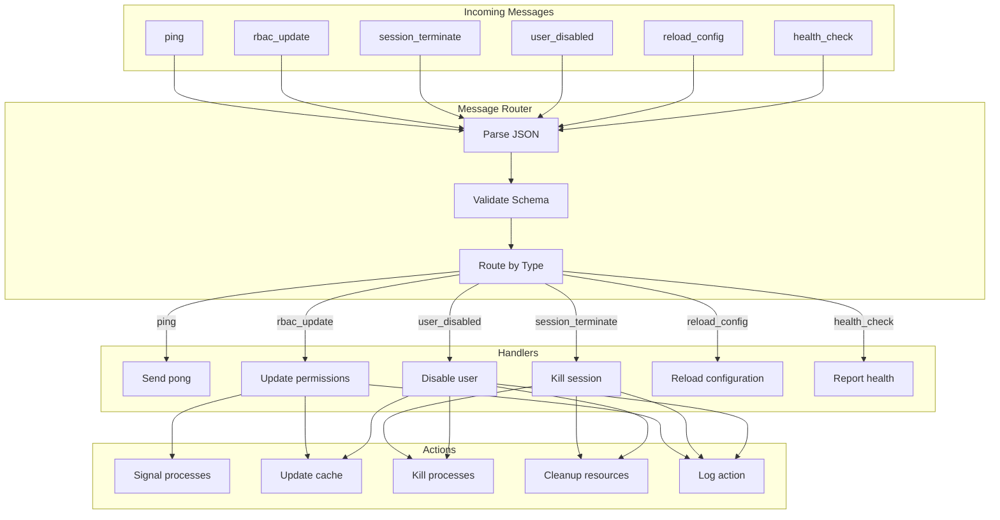
```mermaid
flowchart TD
    subgraph "Incoming Messages"
        M1[ping]
        M2[rbac_update]
        M3[session_terminate]
        M4[user_disabled]
        M5[reload_config]
        M6[health_check]
    end

    subgraph "Message Router"
        PARSE[Parse JSON]
        VALIDATE[Validate Schema]
        ROUTE[Route by Type]
    end

    subgraph "Handlers"
        H1[Send pong]
        H2[Update permissions]
        H3[Kill session]
        H4[Disable user]
        H5[Reload configuration]
        H6[Report health]
    end

    subgraph "Actions"
        A1[Signal processes]
        A2[Update cache]
        A3[Kill processes]
        A4[Cleanup resources]
        A5[Log action]
    end

    M1 & M2 & M3 & M4 & M5 & M6 --> PARSE
    PARSE --> VALIDATE
    VALIDATE --> ROUTE

    ROUTE -->|ping| H1
    ROUTE -->|rbac_update| H2
    ROUTE -->|session_terminate| H3
    ROUTE -->|user_disabled| H4
    ROUTE -->|reload_config| H5
    ROUTE -->|health_check| H6

    H2 --> A1 & A2 & A5
    H3 --> A3 & A4 & A5
    H4 --> A3 & A4 & A2 & A5
```

## 17. Signal Handling in Session Management

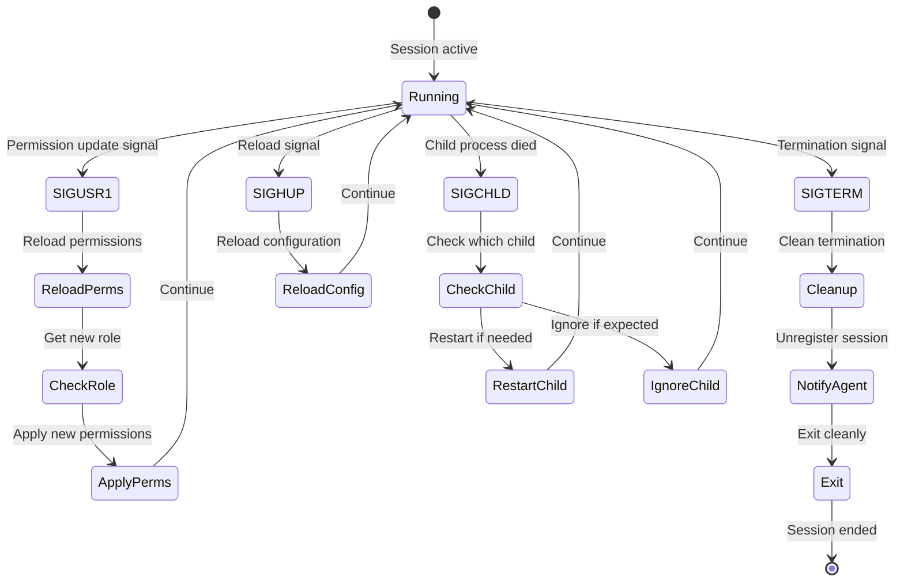
```mermaid
stateDiagram-v2
    [*] --> Running: Session active

    Running --> SIGUSR1: Permission update signal
    Running --> SIGTERM: Termination signal
    Running --> SIGHUP: Reload signal
    Running --> SIGCHLD: Child process died

    SIGUSR1 --> ReloadPerms: Reload permissions
    ReloadPerms --> CheckRole: Get new role
    CheckRole --> ApplyPerms: Apply new permissions
    ApplyPerms --> Running: Continue

    SIGTERM --> Cleanup: Clean termination
    Cleanup --> NotifyAgent: Unregister session
    NotifyAgent --> Exit: Exit cleanly

    SIGHUP --> ReloadConfig: Reload configuration
    ReloadConfig --> Running: Continue

    SIGCHLD --> CheckChild: Check which child
    CheckChild --> RestartChild: Restart if needed
    CheckChild --> IgnoreChild: Ignore if expected
    RestartChild --> Running: Continue
    IgnoreChild --> Running: Continue

    Exit --> [*]: Session ended
```

## 18. Process Kill Hierarchy for User Disable

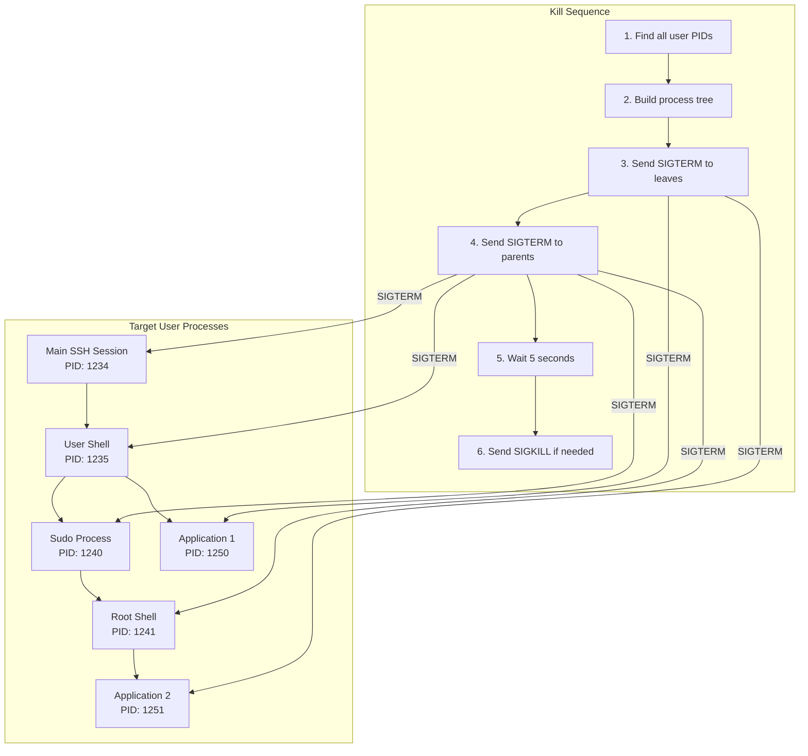
```mermaid
flowchart TD
    subgraph "Target User Processes"
        MAIN[Main SSH Session<br/>PID: 1234]
        SHELL[User Shell<br/>PID: 1235]
        SUDO[Sudo Process<br/>PID: 1240]
        ROOT_SHELL[Root Shell<br/>PID: 1241]
        APP1[Application 1<br/>PID: 1250]
        APP2[Application 2<br/>PID: 1251]
    end

    subgraph "Kill Sequence"
        S1[1. Find all user PIDs]
        S2[2. Build process tree]
        S3[3. Send SIGTERM to leaves]
        S4[4. Send SIGTERM to parents]
        S5[5. Wait 5 seconds]
        S6[6. Send SIGKILL if needed]
    end

    MAIN --> SHELL
    SHELL --> SUDO
    SHELL --> APP1
    SUDO --> ROOT_SHELL
    ROOT_SHELL --> APP2

    S1 --> S2
    S2 --> S3
    S3 -->|SIGTERM| APP1
    S3 -->|SIGTERM| APP2
    S3 --> S4
    S4 -->|SIGTERM| ROOT_SHELL
    S4 -->|SIGTERM| SUDO
    S4 -->|SIGTERM| SHELL
    S4 -->|SIGTERM| MAIN
    S4 --> S5
    S5 --> S6
```

## 19. OAuth Proxy Service Dependencies

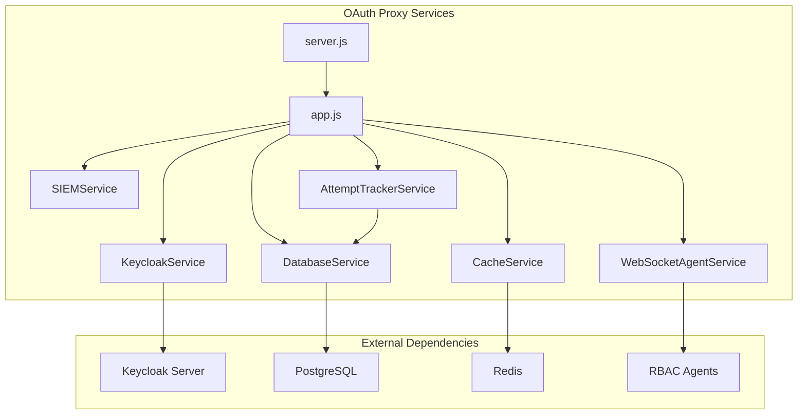
```mermaid
graph TD
    subgraph "OAuth Proxy Services"
        MAIN[server.js]
        APP[app.js]
        KS[KeycloakService]
        WSS[WebSocketAgentService]
        DS[DatabaseService]
        CS[CacheService]
        SIEM[SIEMService]
        ATT[AttemptTrackerService]
    end

    subgraph "External Dependencies"
        KC[Keycloak Server]
        PG[PostgreSQL]
        RD[Redis]
        AGENTS[RBAC Agents]
    end

    MAIN --> APP
    APP --> KS
    APP --> WSS
    APP --> DS
    APP --> CS
    APP --> SIEM
    APP --> ATT

    KS --> KC
    DS --> PG
    CS --> RD
    WSS --> AGENTS
    ATT --> DS
```

## 20. Complete System Health Monitoring

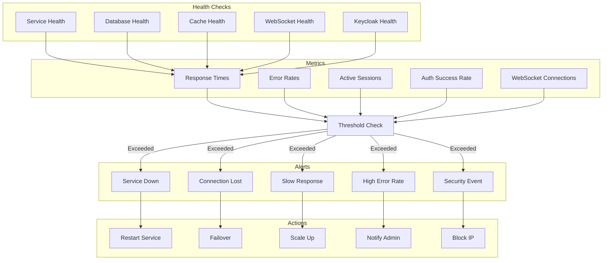
```mermaid
flowchart TD
    subgraph "Health Checks"
        HC1[Service Health]
        HC2[Database Health]
        HC3[Cache Health]
        HC4[WebSocket Health]
        HC5[Keycloak Health]
    end

    subgraph "Metrics"
        M1[Response Times]
        M2[Error Rates]
        M3[Active Sessions]
        M4[Auth Success Rate]
        M5[WebSocket Connections]
    end

    subgraph "Alerts"
        A1[Service Down]
        A2[High Error Rate]
        A3[Slow Response]
        A4[Connection Lost]
        A5[Security Event]
    end

    subgraph "Actions"
        ACT1[Restart Service]
        ACT2[Failover]
        ACT3[Scale Up]
        ACT4[Notify Admin]
        ACT5[Block IP]
    end

    HC1 & HC2 & HC3 & HC4 & HC5 --> M1
    M1 & M2 & M3 & M4 & M5 --> Threshold[Threshold Check]

    Threshold -->|Exceeded| A1 & A2 & A3 & A4 & A5

    A1 --> ACT1
    A2 --> ACT4
    A3 --> ACT3
    A4 --> ACT2
    A5 --> ACT5
```

## Summary

This comprehensive architecture documentation covers all aspects of the CSII authentication and authorization system, including:

1. **Complete authentication flows** with all possible paths (IdP, local, unknown users)
2. **Session lifecycle management** from creation to termination
3. **Real-time RBAC updates** via WebSocket communication
4. **Error recovery** and resilience mechanisms
5. **Security enforcement** including lockouts, fail2ban, and audit logging
6. **MFA support** for both TOTP and WebAuthn
7. **Database schemas** and relationships
8. **Network communication** protocols and ports
9. **Permission mapping** from Keycloak roles to Linux permissions
10. **Health monitoring** and alerting systems
